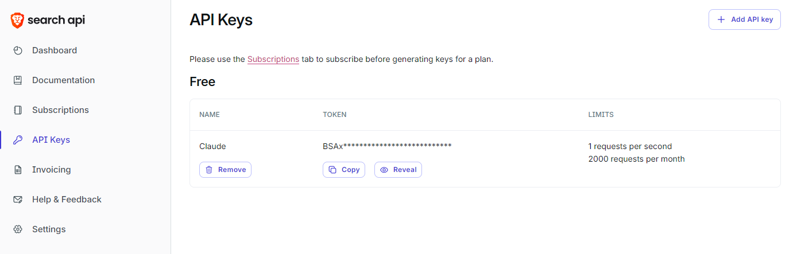
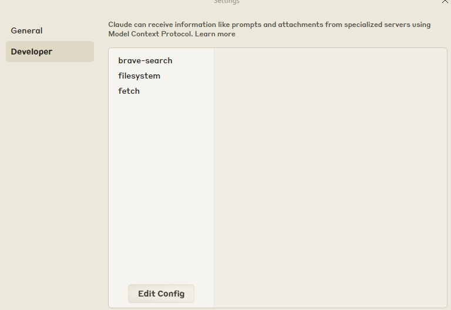
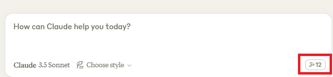
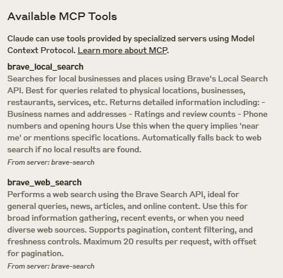
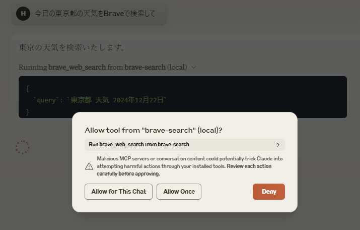
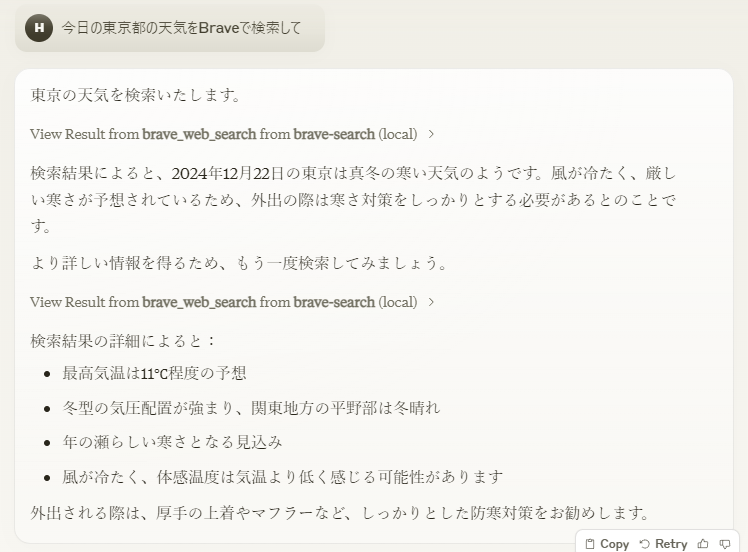

# Introduction
In this article, I tried to use Claude's MCP to search and retrieve information in real time and manipulate files and directories in Local.

# What is Claude MCP (Model Context Protocol)?
It is one of the features of Claude, a fly language model developed by Anthropic, and is a mechanism to easily connect AI with data sources and services.
While conventional Claude does not allow access to functions such as web search, MCP allows you to access the latest data and use it on your own PC,
You can now save and utilize that information on your own PC.

# Preparation
- Install Node.js  
[Node.js](https://nodejs.org/en)  
- Create a Claude account  
[Claude](https://claude.ai/)
- Install Claude Desktop application  
[Claude Desktop](https://claude.ai/download)
- Create a Brave Search API account  
[Brave Search API](https://brave.com/search/api/)

# Environment
- Windows11
- node.js(v22.12.0)

# Brave Search API
Use Claude's prompts to enable web search.
### 1. Get API Key  
Open the Brave Search API screen and issue an API Key.


### 2. write to claude_desktop_config.json
Open the Claude Desktop application and open the configuration screen (Control + ,).  
Press Edit Config on the Developer tab to open the directory where claude_desktop_config.json is located.


Open claude_desktop_config.json in Editor and put in the Brave Search API Key.
``` json
{
  "mcpServers": {
    "brave-search": {
      "command": "npx",
      "args": [
        "-y",
        "@modelcontextprotocol/server-brave-search"
      ],
      "env": {
        "BRAVE_API_KEY": "Put Brave's APIKey here."
      }
    }
  }
}
```
After putting in the above code, save it and restart the Claude-Desktop application. (If not possible, restart the PC and it worked.)

### 3. check the startup
Tap the following button,  

  

If you see “brave_local_search” and “brave_web_search”, it is success.  



When you actually ask for today's weather in Tokyo, you will be asked if you want to use Brave-Search, so allow it and click  



  

Now you can search the web at the Claude prompt.

# Filesystem
This will allow you to manipulate files and directories in Local.

### 1. write to claude_desktop_config.json
Open the Claude Desktop application as before and open the configuration screen (Control + ,).  
Press Edit Config on the Developer tab to open the directory where claude_desktop_config.json is located.
Open claude_desktop_config.json in Editor and add the “filesystem” section.
Change the <username> to your own user.
``` json
{
  // the part you just put in: ----------------------------
  "mcpServers": {
    "brave-search": {
      "command": "npx",
      "args": [
        "-y",
        "@modelcontextprotocol/server-brave-search"
      ],
      "env": {
        "BRAVE_API_KEY": "Put Brave's APIKey here."
      }
    }
    //------------------------------------------
    ,
    "filesystem": {
      "command": "npx", 
      "args": [
        "-y",
        "@modelcontextprotocol/server-filesystem",
        "/Users/<username>/Desktop"
      ]
    }
  }
}
```
After putting in the above code, save it and restart the Claude-Desktop application. (If you can't, restart your PC and it worked.)

### 2. check the startup
Tap the following button,  

  

If the number increases, you have generally succeeded.  
You can do the following in conjunction with the Brave Search API mentioned earlier.  

  

 

A text file with the above content was saved in Desktop.

# Lastly.
In addition to the Brave Search API and Filesystem, there are many other Servers being developed.
It can also be used with Git-related and Google services and databases, so if you are interested, please try to implement it.
Thank you for reading to the end. We look forward to seeing you again next time.


# Reference sites
[MCP Server](https://github.com/modelcontextprotocol/servers?tab=readme-ov-file)     
 I have referred to the following website. 

