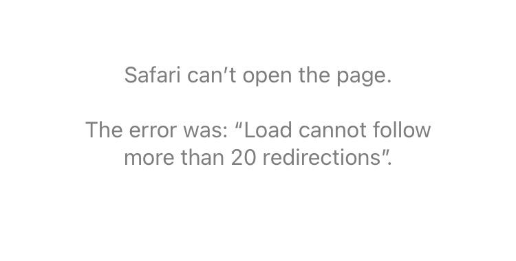

## Introduction
I was trying to manage a domain I got from Name.com with Cloudflare and set up the nameservers,
I opened my blog and found an error `Load cannot follow more than 20 redirections`.  

## SITUATION
- Using a domain obtained from Name.com
- Hosted using GitHub Pages
- Domain managed by Cloudflare

## Conclusion
Cloudflare's SSL/TLS encryption mode was changed from Flexible to Full or Full (strict).  
Select the domain you are managing and in the SSL/TLS > Overview > SSL/TLS Encryption hierarchy there is an entry to set.  

## Cause
Currently, Cloudflare and the origin server are in a redirect loop.  
Cloudflare receives the request over HTTPS, but the origin server returns the request over HTTP and Cloudflare redirects it to HTTPS again, causing a loop.  
This caused a redirect loop because the connection between Cloudflare and GitHub Pages is made in plaintext (unencrypted) and GitHub Pages forces a secure connection.  

Full or Full (strict) will cause Cloudflare to send encrypted requests over HTTPS to the original server.

【Citation】
[Cloudflare Documentation](https://developers.cloudflare.com/ssl/troubleshooting/too-many-redirects/) See.

### Supplementation
What is an origin server...  
The web server on which the original content resides. When publishing your company's pages, etc., if the network configuration is such that they are accessed via a service such as WAF or CDN, rather than directly to the server where the pages are placed, the server that is the connection destination from the WAF or CDN is called the origin server.  
(In the case of this blog, it will be GitHub Pages.)
  

## References
[Cloudflare documentation](https://developers.cloudflare.com/ssl/troubleshooting/too-many-redirects/)  

