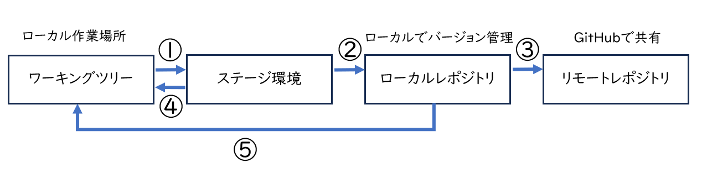
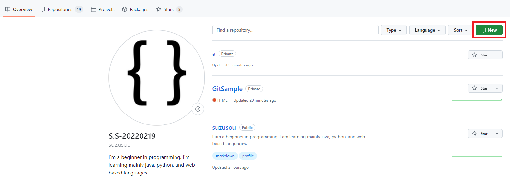
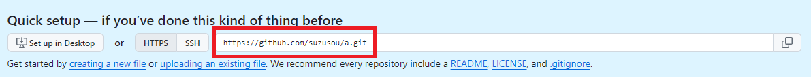
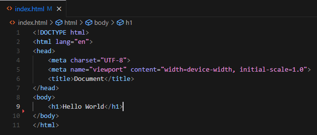

# Introduction
Git is said to be an essential skill for team development.  
In this article, I will explain the basic usage of Git commands as well as my output since I have studied about Git commands.

# Git Setup 
Many people have explained Git setup, so I will omit it here.   
[Git Installation & Setup](https://qiita.com/T-H9703EnAc/items/4fbe6593d42f9a844b1c#%E6%89%8B%E9%A0%862git%E3%81%AE%E3%82%A4%E3%83%B3%E3%82%B9%E3%83%88%E3%83%BC%E3%83%AB)  
[Official GitHub website](https://github.com)

# Git in a Nutshell
Here is an image diagram of Git. From here on, we will refer to this diagram for explanation.  

 

##### Working tree
A working place for editing files.
This is where files are edited, added, deleted, etc.
##### Stage Environment
A place to record files to commit.
Files edited in the working tree are moved to the index using the add command.
##### Local Repository
A place to record commit history and files to upload to the remote repository.
Files on the index are committed to the local repository with the commit command.
##### Remote Repository
A location shared by multiple people.
Upload locally committed files to the remote repository with the push command.

# Manage with Git
In this article, I will explain with only one HTML file to make it as easy to understand as possible.
After creating the HTML file in any folder, open a command prompt and navigate to any folder. 

First, initialize Git. A local repository will be created here.

```git
git init
````
Log in to GitHub and create a repository.  

  

Choose a repository name of your choice, private or public.  

|Type |Meaning |
| ---:| :---: |
|private | Do not make the repository public|
|public | make the repository public to the outside world|  


  

This command will add a new remote repository to your local repository. 
```git
git remote add origin https://github.com/username/reponame.git
```
The added remote repository is named origin and is associated with the URL https://github.com/username/reponame.git.
Now you have linked your local repository to the remote repository.

Write the code in an HTML file.  
With VSCode, you can use "! to create a HTML template.  
In this case, I used ```Hello,World``` in the h1 tag to make it easy to understand.  

  

We will raise it from the work tree to the stage. (Operation shown in Figure 1)

```git
git add index.html
```` git add index.html

index.html" is an arbitrary file name.  
If you want to do all files in the project, use ". (dot) if you want to do all files in the project.  
Next, commit from the stage to the local repository. (Operation shown in Figure 2)

```git
git commit -m "commit message"
```

Now you have committed to the local repository.
If you want to update a file, you can also run the command in the order of work tree -> stage -> local repository, and the file will be updated in the local repository as well.


# Commit local repository to remote repository (GitHub)


After committing to the local repository, push to the remote repository (GitHub). (Operation shown in Figure 3)

```git
git push -u origin master
````

where origin is the name of the remote repository and master is the name of the branch.
Both names are set by default.

# Create a branch
##### branch
Branches are used to branch and record work history.  
Changes on a branch do not and will not affect other branches until they are merged.  

```git
git branch devlop(branch name)
```
The above command will switch branches if the branch name is existing.
If the branch does not exist, it is created.

The command displays the branch you are currently working on.  

```git
git branch 
```
Now you see the branch you just created and your main branch.

```git
* devlop
  main
```

# Commonly used commands

To return to the working tree from the stage environment (operation shown in Figure 4)    

```git
git restore --staged index.html(filename)
```

To restore a local repository to the working tree (operation shown in Figure 5):

```git
git restore index.html(filename)
```

If you want to specify all files, use ". dot in the filename.

# Recommended Blogs
[Building a static site with Hugo](https://bellfat.com/ja-gb/posts/hugo-start/)   


