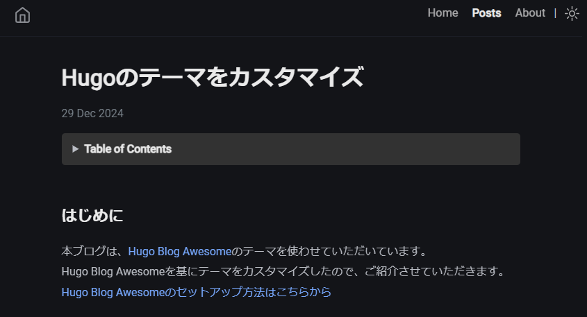
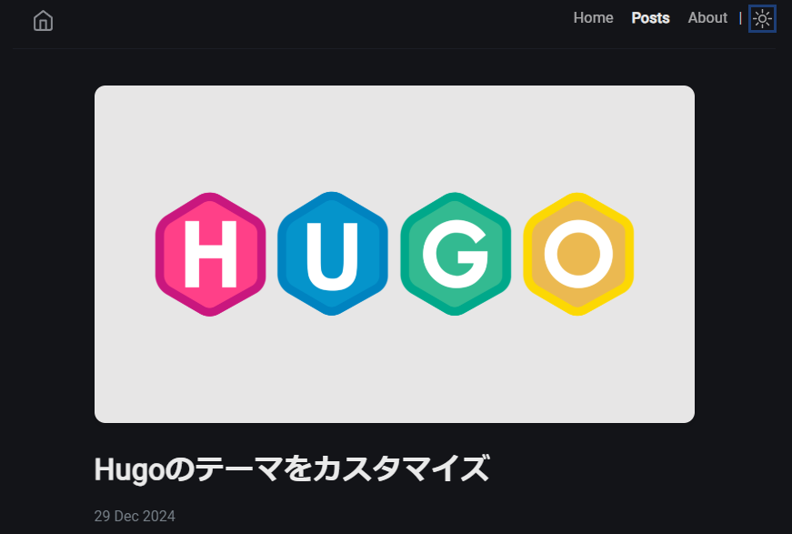
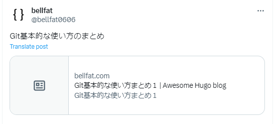

## Introduction
This blog is using the [Hugo Blog Awesome](https://github.com/hugo-sid/hugo-blog-awesome) theme.  
We have customised the theme based on Hugo Blog Awesome.  
[Learn how to set up Hugo Blog Awesome here](https://bellfat.com/posts/hugo-start/)

## Display an image above the title of your blog
Hugo Blog Awesome did not have the ability to place an image above the title of the blog.  



However, I felt it would be tighter and cooler with an image, so I added the ability to put an image above the title.

In /layouts/_default/single.html in the themes that I added as a submodule in themes, blog-related HTML, Go language is written. (varies from theme to theme).
Copy that single.html into /layouts/_default in your own blog and edit it.

```HTML
{{ define "main" }}
<div class="wrapper post">
    <main class="page-content" aria-label="Content">
        <article>
            <header class="header">
                <!-- Add -->
                {{ with .Params.image }}
                <div class="header-image">
                    
                </div>
                {{ end }}
                <!-- Add -->
                <h1 class="header-title">{{ .Title }}</h1>
                {{ $configDateFormat := .Site.Params.dateFormat | default ":date_medium" }}
                {{ with .Date }}
                {{ $ISO_time := dateFormat "2006-01-02T15:04:05-07:00" . }}
                <div class="post-meta">
                    <time datetime="{{ $ISO_time }}" itemprop="datePublished"> {{ . | time.Format $configDateFormat }} </time>
                </div>
                {{ end }}
            </header>
            {{ partial "toc.html" .}}
            <div class="page-content">
                {{ .Content }}
            </div>
        </article>
        {{- partial "comments.html" . -}}
    </main>
</div>
{{ end }}
```


The CSS accompanying that code is copied from /assets/sass/_posts.scss in the theme you added as a submodule, brought to /assets/sass in your blog and then edited.  

Set the size of the images around the Header and the sense of each element.
```scss
.header {
  margin-top: 2em;.

  .header-image {
    margin-bottom: 2em;
    text-align: centre;

    img {
      max-width: 100%;
      height: auto;
      border-radius: 12px; 
      box-shadow: 0 4px 6px rgba(0, 0, 0, 0.1);
    }
  }
  .header-title {
    font-size: 2em;
    line-height: 1.2;
    margin-top: 10px;
    margin-bottom: 20px;

    &.center {
      text-align: center;
    }

    @include media-query($on-mobile) {
      font-size: 1.9em;
    }
  }
}
```
All that's left is to set the image name in the front matter of content/en/post/blogname/index.md.

```yaml
title: Customise Hugo theme
date: 2024-12-29
author: Bellfat
description: customise the Hugo theme
image: title.png
tags:
  - emoji
```

You have successfully displayed an image above the title.



## Set the article image in X

Posting with the article URL in X resulted in no image in the left part, as shown in the following image.



You can find blog-related meta information in /layouts/partials/meta/standard.html in the themes you have added as a sub-module within themes. (This varies from theme to theme.)
Copy that standard.html into /layouts/partials/meta/ in your own blog and edit it.

```HTML
<!-- Add the following meta information -->
<meta itemprop="image" content="{{ .Permalink }}{{ .Params.image }}" />
<meta property="og:image" content="{{ .Permalink }}{{ .Params.image }}" />
<meta name="twitter:image" content="{{ .Permalink }}{{ .Params.image }}" />
<meta name="twitter:image:src" content="{{ .Permalink }}{{ .Params.image }}" />
<meta name="twitter:card" content="summary_large_image">
<meta name="twitter:site" content="@Bellfat0606">
<meta name="twitter:title" content="Bellfat-Blog">
```

### *Supplement
`{{ .Permalink }}` is a URL set for each and every page and is a link that is intended to remain permanently unchanged when its content is updated. 
By default, it is set to the path to a file under content.  
```HTML
https://bellfat.com/posts/Hugo-Customization/  
```
`{{ .Params.image }}` retrieves the filename of the image specified in content/en/post/blogname/index.md.
```HTML
title.png
```  

With the meta information set as above, the post will look like the following post.  




## References
[Hugo blog awesome](https://themes.gohugo.io/themes/hugo-blog-awesome/)  
[Checklist for when article images don't show up when sharing on X (Twitter)](https://push.tokyo/x-twitter-image-display/) 


## Related articles
[How to set up Hugo Blog Awesome](https://bellfat.com/posts/hugo-start/) 