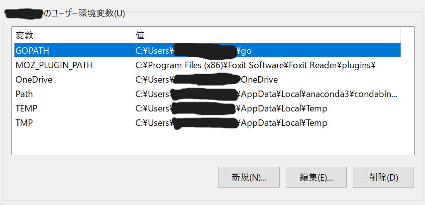

I have set up my own blog with Hugo and will summarize how to do it.  
## Installing Hugo  
[Hugo Releases](https://github.com/gohugoio/hugo/releases) Go to this site and
Download “hugo_extended_version_number_OS_name.zip”. Then extract the zip file and register it in the PATH environment variable.

In my case, I put the extracted file in C:/Hugo and added it to the PATH environment variable.
You can check the version with this command.
```bash
hugo -version
```

If you see the version number you installed, you have set the environment variable.
```bash
hugo v0.126.2-8f3d902ce51512931f5759e9279d93e346c9e649+extended windows/amd64 BuildDate=2024-05-30T15:19:22Z VendorInfo=gohugoio
```


## Install Golang  
Go to [official Go language](https://go.dev/dl/) and download the installer.
After opening the installer, basically choose Next.

After that, make sure your environment variables are registered.


## Create site
Create a Hugo site with the following command.
```bash
hugo new site arbitrary folder name
```
Navigate to the path and check the contents of the folder.
```bash
cd . /optional folder name
tree /f
```

```bash
C:.
│ hugo.toml
│ hugo.toml
├─archetypes
│ default.md
│ ├─assets
├─assets
├─content
├─data
├─i18n
├─layouts
├─static
└─themes
```

## theme settings
[Hugo themes](https://themes.gohugo.io/) Choose a theme you like.
Clone the theme in the themes folder.
```bash
git clone https://github.com/hugo-sid/hugo-blog-awesome.git themes/hugo-blog-awesome
```
Make sure you see the template.

```bash
hugo serve -D
```
[Hugo blog awesome](https://themes.gohugo.io/themes/hugo-blog-awesome/) to change various items.

## Reference Site
[I tried using HUGO](https://zenn.dev/ttr0108/articles/1_hugo_introduction)   
[Hugo blog awesome](https://themes.gohugo.io/themes/hugo-blog-awesome/)  
 for reference. 