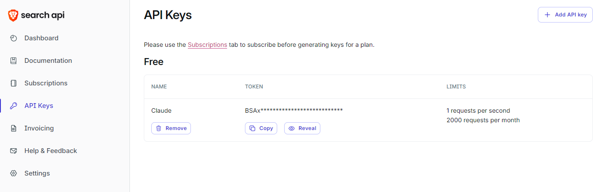
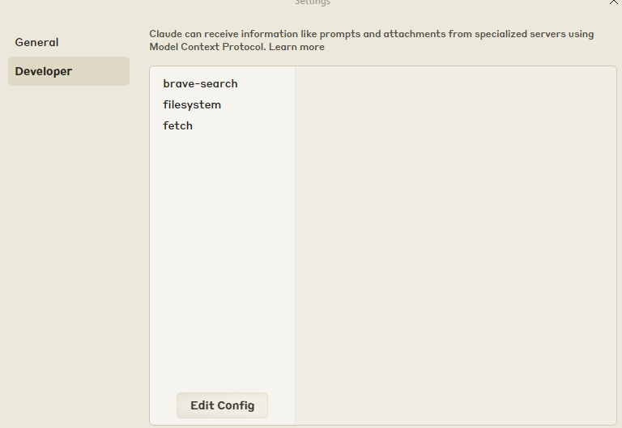
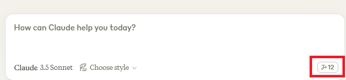
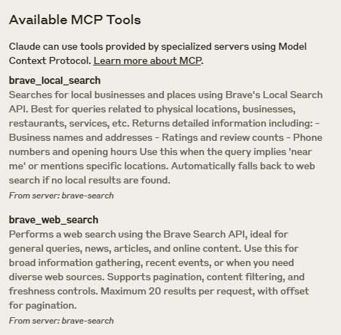
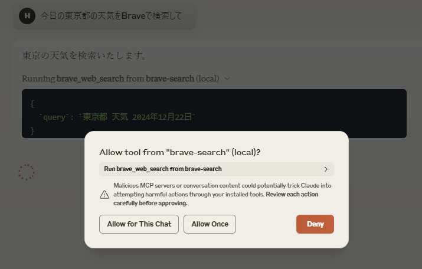
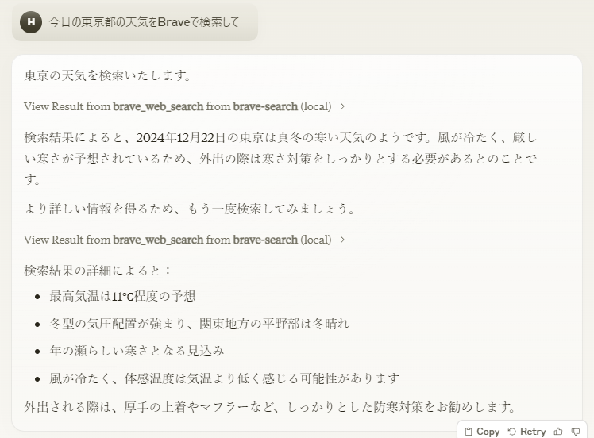
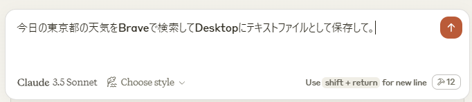
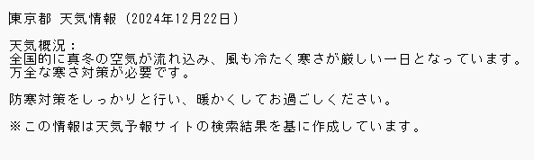

## はじめに
今回は、ClaudeのMCPを使ってリアルタイム検索して情報を取得したり、Localにあるファイルやディレクトリを操作してみました。

## Claude MCP(Model Context Protocol)とは
Anthropicが開発しているフライ言語モデル「Claude」の機能の一つでAIとデータソースやサービスとを簡単に繋げられる仕組みです。
従来のClaudeではWEB検索のような機能にアクセスすることができませんでしたが、MCPを使えば最新のデータにアクセスして、
その情報を自分のPCに保存して活用することができるようになりました。

## 事前準備
- Node.jsのインストール  
[Node.js](https://nodejs.org/en)  
- Claude アカウントの作成  
[Claude](https://claude.ai/)
- Claude Desktop アプリのインストール  
[Claude Desktop](https://claude.ai/download)
- Brave Search API　アカウント作成  
[Brave Search API](https://brave.com/search/api/)

## 環境
- Windows11
- node.js(v22.12.0)

## Brave Search APIの導入
Claudeのプロンプトを使い、Web検索できるようにします。
### 1. API Keyの発行  
Brave Search APIの画面を開き、API Keyを発行してください。


### 2. claude_desktop_config.jsonに書き込む
Claude Desktopアプリを開き、設定画面(Control + ,)を開きます。  
DeveloperタブのEdit Configを押すと、claude_desktop_config.jsonがあるディレクトリが開きます。


claude_desktop_config.jsonをEditorで開き、Brave Search APIのKeyを入れます。
```json
{
  "mcpServers": {
    "brave-search": {
      "command": "npx",
      "args": [
        "-y",
        "@modelcontextprotocol/server-brave-search"
      ],
      "env": {
        "BRAVE_API_KEY": "BraveのAPIKeyをここに入れる"
      }
    }
  }
}
```
上記のコードを入れたら保存し、Claude-Desktopアプリを再起動してください。(できない場合、PC再起動すれば動きました)

### 3. 起動確認
下記のボタンをタップし、  

  

brave_local_searchとbrave_web_searchが入っていたら成功です。  



実際に今日の東京の天気を聞くと、Brave-Searchを使用していいか確認されるので許可し  



  

これでClaudeのプロンプトでWeb検索ができるようになりました。

## Filesystemの導入
Localにあるファイルやディレクトリ操作をできるようにします。

### 1. claude_desktop_config.jsonに書き込む
先ほどと同様にClaude Desktopアプリを開き、設定画面(Control + ,)を開きます。  
DeveloperタブのEdit Configを押すと、claude_desktop_config.jsonがあるディレクトリが開きます。
claude_desktop_config.jsonをEditorで開き、「filesystem」の部分を追加します。
<ユーザー名>のところは自分のユーザーに変えてください。
``` json
{
  //先ほど入れた部分----------------------------
  "mcpServers": {
    "brave-search": {
      "command": "npx",
      "args": [
        "-y",
        "@modelcontextprotocol/server-brave-search"
      ],
      "env": {
        "BRAVE_API_KEY": "BraveのAPIKeyをここに入れる"
      }
    }
    //------------------------------------------
    ,
    "filesystem": {
      "command": "npx",
      "args": [
        "-y",
        "@modelcontextprotocol/server-filesystem",
        "/Users/<ユーザー名>/Desktop"
      ]
    }
  }
}
```
上記のコードを入れたら保存し、Claude-Desktopアプリを再起動してください。(できない場合、PC再起動すれば動きました)

### 2. 起動確認
下記のボタンをタップし、  

  

数字が増えていれば、大体成功しています。  
先ほどのBrave Search APIとの連携で以下のようなことができます。  

  

 

Desktopに上記の内容のテキストファイルが保存されていました。

## 最後に
Brave Search APIやFilesystemの他にも色々なServerが開発されているそうです。
Git関連やGoogleサービス、データベースとも連携できるのでぜひ興味がある方は実装してみてください。
最後まで読んでいただきありがとうございました。次回もぜひよろしくお願いします。


## 参考サイト
[MCP Server](https://github.com/modelcontextprotocol/servers?tab=readme-ov-file)   
 を参考にさせていただきました。 
