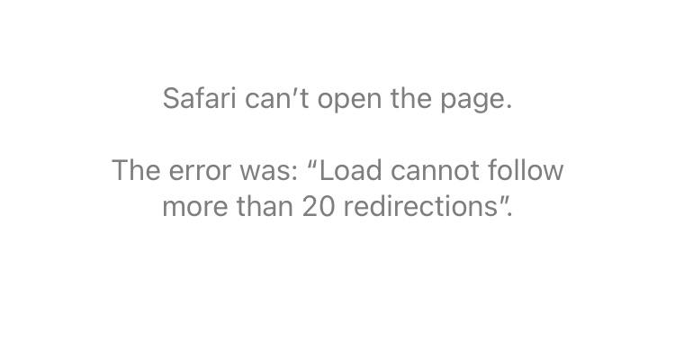
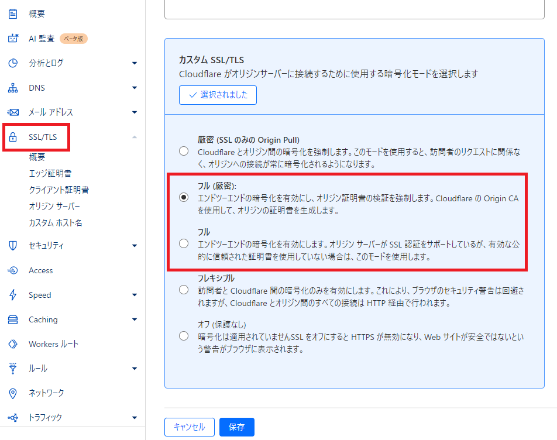
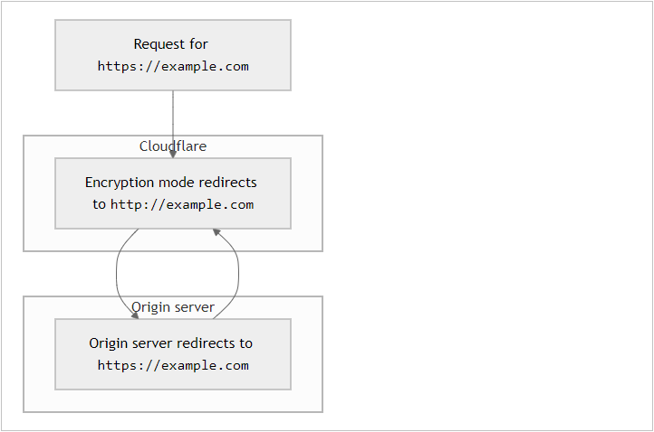

## はじめに
お名前ドットコムで取得したドメインをCloudflareで管理しようとしてネームサーバの設定をし、
自分のブログを開いてみたら`Load cannot follow more than 20 redirections`とエラーが出ていました。  

## 状況整理
- お名前ドットコムで取得したドメインを使用
- GitHub Pagesを利用してホスティング
- ドメインをCloudflareで管理

## 結論
CloudflareのSSL/TLS暗号化モードをフレキシブルからフル又はフル（厳密）に変更した。  
管理しているドメインを選択して、SSL/TLS > 概要 > SSL/TLS 暗号化の階層に設定する項目があります。  

## 原因
現状、Cloudflareとoriginサーバーがリダイレクトループしている状態になっています。  
CloudflareはHTTPSでリクエストを受けますが、オリジンサーバーがHTTPでリクエストを返し、再度CloudflareがHTTPSにリダイレクトすることでループが発生します。  
このため、CloudflareとGitHub Pages間の接続が平文（未暗号化）で行われ、GitHub Pagesがセキュアな接続を強制するためリダイレクトループが生じていました。  

フル または フル（厳密）にすることでCloudflareは、HTTPSを介して暗号化された要求を元のサーバーに送信します。

<引用>  
[Cloudflareドキュメント](https://developers.cloudflare.com/ssl/troubleshooting/too-many-redirects/) 参照

### ※補足
originサーバーとは...  
オリジナルのコンテンツが存在する Web サーバーのことです。自社ページなどを公開する際に、ページを配置したサーバに直接アクセスさせるのではなく WAF や CDN などのサービスを経由させてアクセスさせるネットワーク構成としたときに、WAF や CDN から見た接続先となるサーバをオリジンサーバと呼びます。  
(本ブログの場合は、GitHub Pagesになる)
  

## 参考サイト
[Cloudflareドキュメント](https://developers.cloudflare.com/ssl/troubleshooting/too-many-redirects/)  

