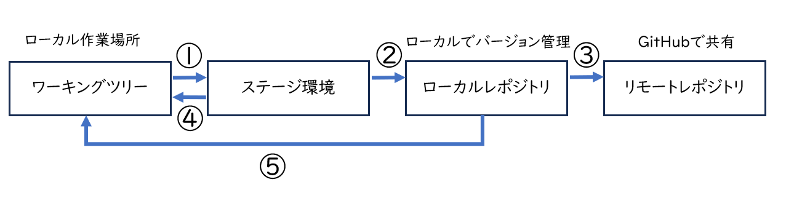
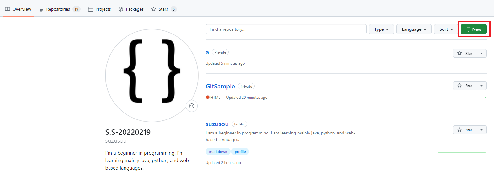
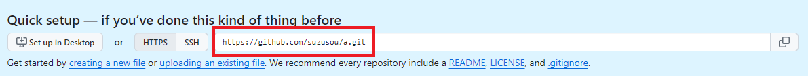
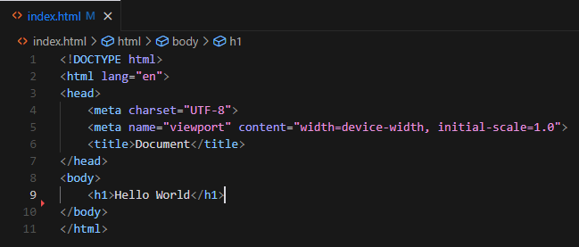

# はじめに
Gitはチーム開発をする上で必須スキルと言われています。  
今回はGitコマンドについて勉強したので私のアウトプットも兼ねて、Gitコマンドの基本的な使い方を解説していきます。

# Gitのセットアップ 
Gitセットアップの解説されている方は多いのでここでは省略します。   
[Gitインストール＆セットアップ](https://qiita.com/T-H9703EnAc/items/4fbe6593d42f9a844b1c#%E6%89%8B%E9%A0%862git%E3%81%AE%E3%82%A4%E3%83%B3%E3%82%B9%E3%83%88%E3%83%BC%E3%83%AB)  
[GitHub公式サイト](https://github.com)

# Git全体像
Gitのイメージ図はこちらです。ここからはこの図を参照して解説していきます。  

 

##### ワーキングツリー
ファイルの編集作業場所。
ここでファイルの編集や追加や削除などを行う。
##### ステージ環境
コミットするためのファイルを記録する場所。
ワーキングツリーで編集したファイルはaddコマンドでインデックスへ移動させる。
##### ローカルリポジトリ
リモートリポジトリにアップロードするためのコミット履歴とファイルを記録する場所。
インデックス上のファイルをcommitコマンドでローカルリポジトリにコミットする。
##### リモートリポジトリ
複数人で共有する場所。
ローカルコミットしたファイルをpushコマンドでリモートリポジトリにアップロードする。

# Gitで管理する
今回はなるべくわかりやすいようにHTMLファイル１つだけで解説していきます。
任意のフォルダーでHTMLファイルを作成した後、コマンドプロンプトを開き任意のフォルダーまで移動してください。 

まず、Gitの初期化を行います。ここでローカルレポジトリが作成されます。

```git
git init
```
GitHubへログイン後レポジトリを作成してください。  

  

任意のレポジトリ名を決め、privateかpublicを選択してください。  

|種類 | 意味 |
|---:| :---: |
|private | レポジトリを外部へ公開しない|
|public | レポジトリを外部へ公開する|  


  

このコマンドを実行すると、ローカルリポジトリに新しいリモートリポジトリが追加されます。 
```git
git remote add origin https://github.com/username/reponame.git
```
追加されたリモートリポジトリには、originという名前が付けられ、https://github.com/username/reponame.git というURLが紐付けられます。  
これでローカルレポジトリとリモートレポジトリの連携ができました。

HTMLファイルにコードを記述してください。  
VSCodeだと、「!」でHTMLの雛型が作成できます。  
今回はわかりやすいように、h1タグで```Hello,World```と記述しました。  

  

ワークツリーからステージへあげていきます。(図①の操作)

```git
git add index.html
```

「index.html」は任意のファイル名です。  
プロジェクト内のファイルすべてやりたいときは、「.」(ドット)を使ってください。  
次は、ステージからローカルレポジトリへコミットしていきます。(図②の操作)

```git
git commit -m "コミットメッセージ"
```

これでローカルレポジトリへコミットできました。
ファイルを更新したい場合も、ワークツリー→ステージ→ローカルレポジトリの順にコマンドを実行していけば、ローカルレポジトリにも更新されます。


# ローカルレポジトリをリモートレポジトリ（GitHub）に


ローカルレポジトリへコミット後、リモートレポジトリ（GitHub）へpushしていきます。(図③の操作)

```git
git push -u origin master
```

originはリモートレポジトリ名、masterはブランチ名です。
両方ともデフォルトで設定される名称です。

# ブランチを作成
##### ブランチ
ブランチは作業履歴を枝分かれさせて記録していくためのもの。  
ブランチ上での変更は統合されるまで他ブランチに影響しないしされない。  

```git
git branch devlop(ブランチ名)
```
上記のコマンドを実行すると、既存のブランチ名の場合は、ブランチを切り替える。
ブランチが存在しない場合は、ブランチが作成される。

現在作業しているブランチを表示させるコマンド。  

```git
git branch 
```
先ほど作成したブランチとmainブランチが表示された。
```git
* devlop
  main
```


# よく使うコマンド

ステージ環境からワークキングツリーに戻したいとき(図④の操作)    

```git
git restore --staged index.html(ファイル名)
```

ローカルレポジトリからワークキングツリーに戻したいとき(図⑤の操作)  

```git
git restore index.html(ファイル名)
```

ファイルをすべて指定したい場合は、「.」ドットをファイル名に指定してください。

# おすすめブログ
[Hugoで静的サイトを構築](https://bellfat.com/ja-gb/posts/hugo-start/)   

