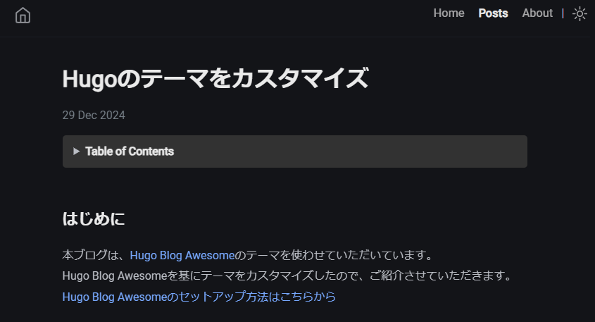
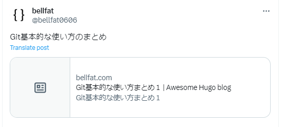

## はじめに
本ブログは、[Hugo Blog Awesome](https://github.com/hugo-sid/hugo-blog-awesome)のテーマを使わせていただいています。  
Hugo Blog Awesomeを基にテーマをカスタマイズしたので、ご紹介させていただきます。
[Hugo Blog Awesomeのセットアップ方法はこちらから](https://bellfat.com/ja-gb/posts/hugo-start/)

  
## ブログのタイトルの上に画像を表示させる
Hugo Blog Awesomeは、ブログのタイトルの上に画像を載せる機能はありませんでした。  



ですが、画像があった方が引き締まっててかっこいいと感じたのでタイトルの上に画像を載せる機能を追加しました。

themes内にあるサブモジュールとして追加したテーマ内の /layouts/_default/single.html にブログ関連のHTML,Go言語が書かれています。（テーマによって異なる）
そのsingle.htmlを自分のブログ内の /layouts/_default にコピーして編集していきます。

```HTML
{{ define "main" }}
<div class="wrapper post">
    <main class="page-content" aria-label="Content">
        <article>
            <header class="header">
                <!-- 追加した部分 -->
                {{ with .Params.image }}
                <div class="header-image">
                    
                </div>
                {{ end }}
                <!-- 追加した部分 -->
                <h1 class="header-title">{{ .Title }}</h1>
                {{ $configDateFormat := .Site.Params.dateFormat | default ":date_medium" }}
                {{ with .Date }}
                {{ $ISO_time := dateFormat "2006-01-02T15:04:05-07:00" . }}
                <div class="post-meta">
                    <time datetime="{{ $ISO_time }}" itemprop="datePublished"> {{ . | time.Format $configDateFormat }} </time>
                </div>
                {{ end }}
            </header>
            {{ partial "toc.html" .}}
            <div class="page-content">
                {{ .Content }}
            </div>
        </article>
        {{- partial "comments.html" . -}}
    </main>
</div>
{{ end }}
```

そのコードに付随するCSSはサブモジュールとして追加したテーマ内の /assets/sass/_posts.scss をコピーし、自分のブログ内の /assets/sass に持ってきてから編集します。  

Header周辺の画像の大きさや各要素の感覚を整えます。
```scss
.header {
  margin-top: 2em;

  .header-image {
    margin-bottom: 2em;
    text-align: center;

    img {
      max-width: 100%;
      height: auto;
      border-radius: 12px; 
      box-shadow: 0 4px 6px rgba(0, 0, 0, 0.1);
    }
  }
  .header-title {
    font-size: 2em;
    line-height: 1.2;
    margin-top: 10px;
    margin-bottom: 20px;

    &.center {
      text-align: center;
    }

    @include media-query($on-mobile) {
      font-size: 1.9em;
    }
  }
}
```
後は、content/ja/post/ブログ名/index.mdのフロントマターに画像名を設定するだけです。

```yaml
title: Hugoのテーマをカスタマイズ
date: 2024-12-29
author: Bellfat
description: Hugoのテーマをカスタマイズ
image: title.png
tags:
  - emoji
```

無事にタイトルの上に画像を表示させることに成功しました。


## Xの記事画像を設定する

Xに記事のURLを入れてポストすると以下の画像のように、左部分に画像がない状態でした。



themes内にあるサブモジュールとして追加したテーマ内の /layouts/partials/meta/standard.html にブログ関連のメタ情報が記載されています。（テーマによって異なる）
そのstandard.htmlを自分のブログ内の /layouts/partials/meta/ にコピーして編集していきます。

```HTML
<!-- 以下のメタ情報を追加 -->
<meta itemprop="image" content="{{ .Permalink }}{{ .Params.image }}" />
<meta property="og:image" content="{{ .Permalink }}{{ .Params.image }}" />
<meta name="twitter:image" content="{{ .Permalink }}{{ .Params.image }}" />
<meta name="twitter:image:src" content="{{ .Permalink }}{{ .Params.image }}" />
<meta name="twitter:card" content="summary_large_image">
<meta name="twitter:site" content="@Bellfat0606">
<meta name="twitter:title" content="Bellfat-Blog">
```

### ※補足
`{{ .Permalink }}`は1つ1つのページに設定される URL で、 そのコンテンツの内容を更新しても永久に変わらないことを意図するリンクです。 
デフォルトでは content 配下のファイルへのパスが設定されています。  
```HTML
https://bellfat.com/ja-gb/posts/Hugo-Customization/  
```
`{{ .Params.image }}`はcontent/ja/post/ブログ名/index.mdで指定した画像のファイル名を取得します。
```HTML
title.png
```  

上記のようにメタ情報を設定すると、以下のポストのような見た目になります。  




## 参考サイト
[Hugo blog awesome](https://themes.gohugo.io/themes/hugo-blog-awesome/)  
[X(Twitter)でシェアー時の記事画像が表示されない時のチェックリスト](https://push.tokyo/x-twitter-image-display/) 


## 関連記事
[Hugo Blog Awesomeのセットアップ方法](https://bellfat.com/ja-gb/posts/hugo-start/)  

