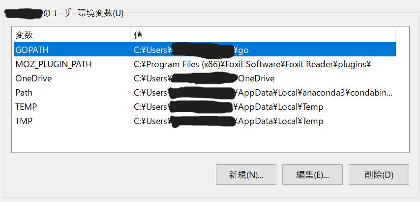

今回は、Hugoで自分のブログを立ち上げたのでそのやり方をまとめていきます。  
# Hugoのインストール  
[Hugo Releases](https://github.com/gohugoio/hugo/releases) こちらのサイトにアクセスして
hugo_extended_バージョン番号_OS名.zipをダウンロードしてください。その後、zipファイルを展開し環境変数のPATHに登録してください。

私の場合ですと、C:/Hugoに展開したファイルを置き、環境変数PATHに追加しました。
こちらのコマンドでバージョンを確認できます。
```bash
hugo -version
```

インストールしたバージョン番号が出ていれば、環境変数の設定ができています。
```bash
hugo v0.126.2-8f3d902ce51512931f5759e9279d93e346c9e649+extended windows/amd64 BuildDate=2024-05-30T15:19:22Z VendorInfo=gohugoio
```


# Golangのインストール  
[Go言語の公式](https://go.dev/dl/) にアクセスしてインストーラーをダウンロードしてください。
インストーラーを開いたら基本的にはNextを選んでください。

その後、環境変数が登録されているかを確認してください。


# サイト作成
以下のコマンドでHugoのサイトを作成します。
```bash
hugo new site 任意のフォルダ名
```
パスを移動して、フォルダの中身を確認します。
```bash
cd ./任意のフォルダ名
tree /f
```

```bash
C:.
│  hugo.toml
│
├─archetypes
│      default.md
│
├─assets
├─content
├─data
├─i18n
├─layouts
├─static
└─themes
```

# テーマ設定
[Hugoテーマ](https://themes.gohugo.io/) 自分の好きなテーマを選んでください。
themesフォルダの中にテーマをクローンします。
```bash
git clone https://github.com/hugo-sid/hugo-blog-awesome.git themes/hugo-blog-awesome
```
テンプレートが表示されているか確認してください。

```bash
hugo serve -D
```
[Hugo blog awesome](https://themes.gohugo.io/themes/hugo-blog-awesome/) を参考に様々な項目を変更できます。

# 参考サイト
[HUGO使ってみた](https://zenn.dev/ttr0108/articles/1_hugo_introduction)   
[Hugo blog awesome](https://themes.gohugo.io/themes/hugo-blog-awesome/)  
 を参考にさせていただきました。 
